# The Netball Summary

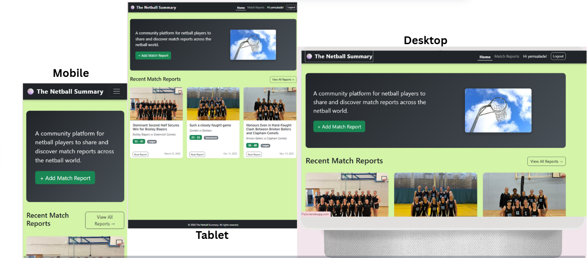

A centralised platform for netball players, coaches and fans to create and share match reports. Instead of results being scattered across individual team pages and social media, The Netball Summary brings them together in one place - searchable, filterable and community-driven.

**Live site:** [https://the-netball-summary-168dbfef7a3e.herokuapp.com](https://the-netball-summary-168dbfef7a3e.herokuapp.com)

**GitHub repository:** [https://github.com/YemsAla/the_netball_summary](https://github.com/YemsAla/the_netball_summary)

## Table of Contents

- [Project Goals] (#project-goals)
- [User Stories] (#user-stories)
- [Design] (#design)
    - [Wireframes](#wireframes)
    - [Database Schema] (#database-schema)
    - [Colour Scheme and Typography](#colour-scheme-and-typography)
    - [Features](#features)
  - [Existing Features](#existing-features)
  - [Future Features](#future-features)
- [Technologies Used](#technologies-used)
- [Testing](#testing)
  - [Manual Testing](#manual-testing)
  - [Bugs and Fixes](#bugs-and-fixes)
  - [Responsiveness](#responsiveness)
  - [Browser Compatibility](#browser-compatibility)
- [Deployment](#deployment)
- [Credits](#credits)

---

## Project Goals

### External user goals

- Record the details of a netball match they have played or witnessed, including a score, image and written summary. They can also record the MVPs as voted by their team and the opposition.
- Browse and search match reports shared by other players to learn, compare performances and gain insights across all match types (leagues/friendlies/tournaments).

### Site owner goals

- Provide a reliable, community-driven platform that's easy-to-use, where netball players can document and share their match experiences.
- Build an engaged community where users regularly contribute their match reports and interact with each other's content by leaving comments.

---

## User Stories

    ✅ - successfully implemented
    ❌ - yet to be implemented

✅ 1. As a visitor, I want to browse all match reports without an account so that I can explore the platform before registering.

✅ 2. As a player, I want to register for an account so that I can create and manage my own match reports.

✅ 3. As a logged-in user, I want to create a match report so that I can document a match my team played.

✅ 4. As a logged-in user, I want to edit my own match report so that I can correct or update details after posting.

✅ 5. As a logged-in user, I want to delete my own match report so that I can remove reports I no longer want published.

✅ 6. As a logged-in user, I want to comment on any match report so that I can engage with reports from other teams.

✅ 7. As a visitor, I want to search reports by team name so that I can quickly find reports relevant to a team I follow.

✅ 8. As a visitor, I want to filter reports by match type so that I can distinguish between different match types.

✅ 9. As a site owner, I want editing restricted to report authors so that content integrity is maintained.

✅ 10. As a site owner, I want pagination on the reports list so that the page doesn't become exhaustive as the number of reports grows.

❌ 11. As a user, I want to like match reports so that I can show appreciation for content without having to comment

❌ 12. As a user, I want a forgotten password option so that I can recover my account if I forget my credentials.

---

## Design

### Wireframes

Wireframes were created for all key pages in desktop and mobile to plan layout and user flow.

#### Homepage

| Desktop | Mobile |
|---------|--------|
| 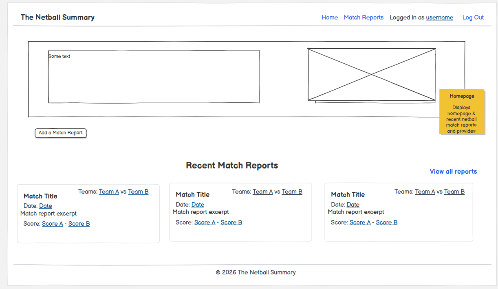 | 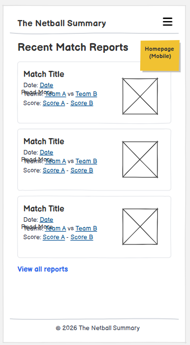 |

#### Match Reports List

| Desktop | Mobile |
|---------|--------|
| 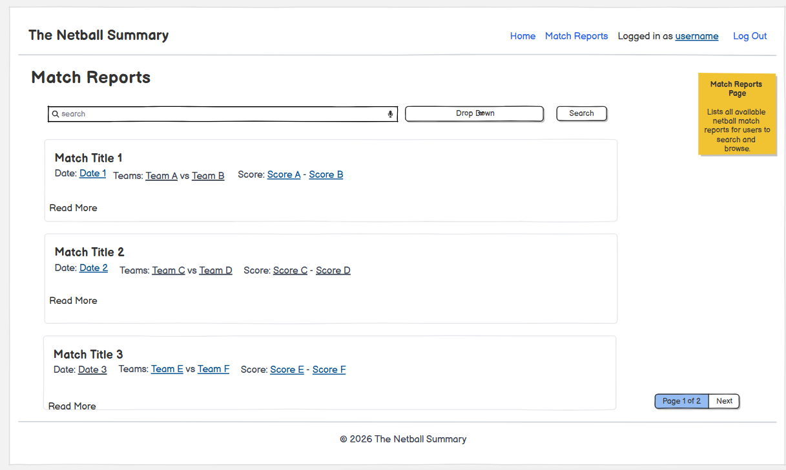 | 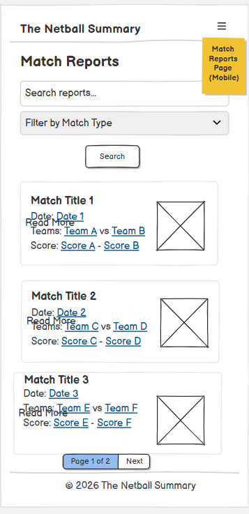 |

#### Match Report Detail

| Desktop | Mobile |
|---------|--------|
| 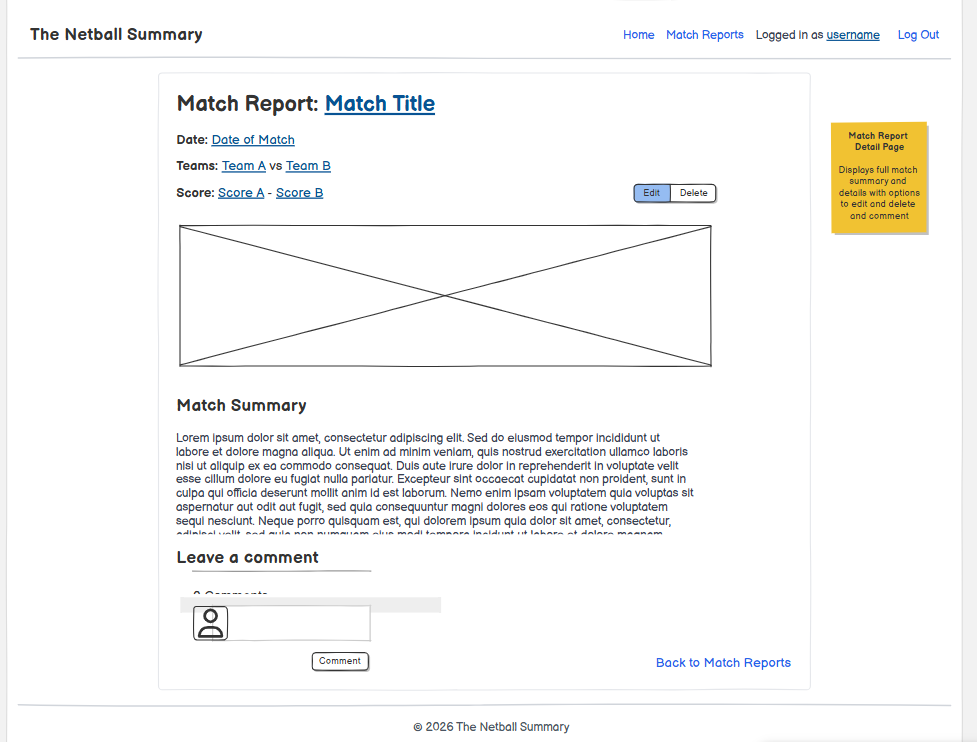 | 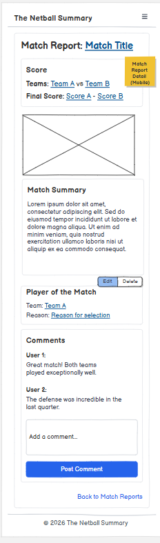 |

#### Create / Edit Report Form

| Desktop | Mobile |
|---------|--------|
| 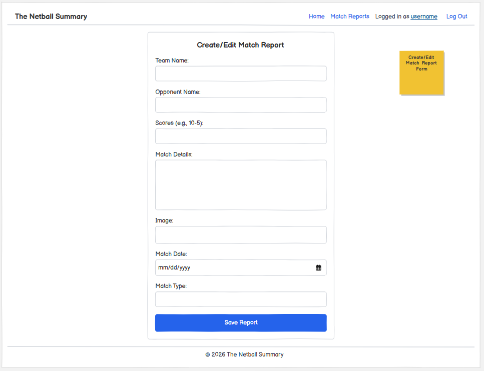 | 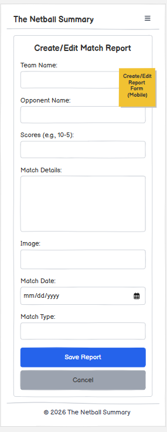 |

#### Login / Register

| Desktop | Mobile |
|---------|--------|
| 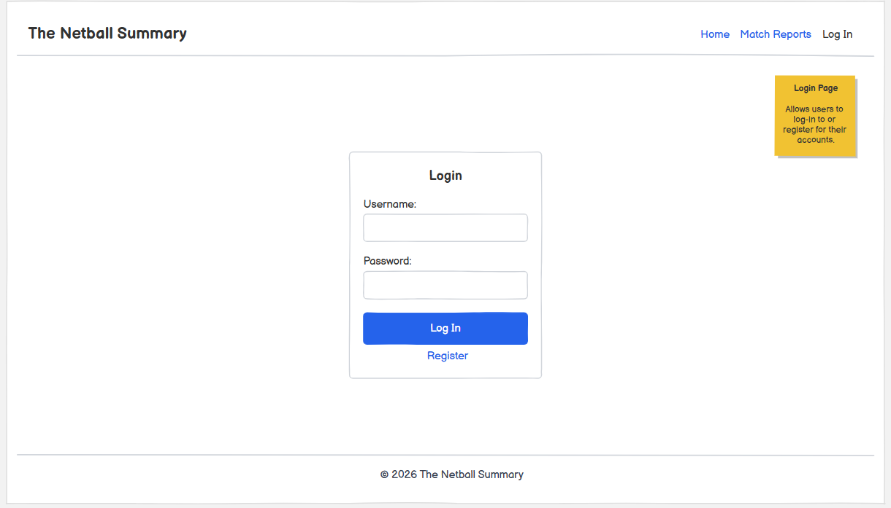 | 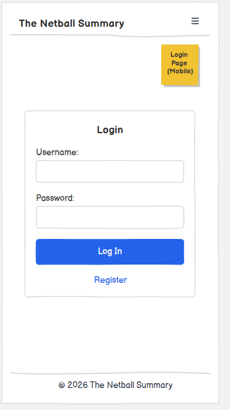 |

---

### Database Schema (ERD)

The database was designed to support match report creation and community interation.

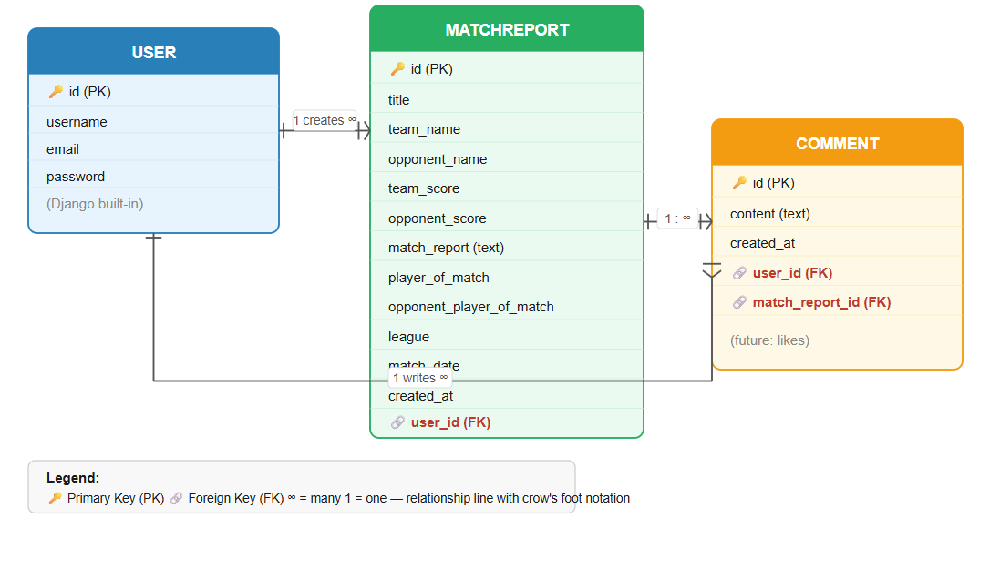

**Relationships:**

- One `User` can create many `MatchReport` records (one-to-many)
- One `MatchReport` can have many `Comment` records (one-to-many)
- One `User` can write many `Comment` records (one-to-many)

**Design Decisions:**

Rather than creating separate `Team` & `League` tables, these were implemented as simple text fields within `Match Report` to reduce complexity for this MVP phase. The structure is designed so that it can be extended in future iterations.

---

