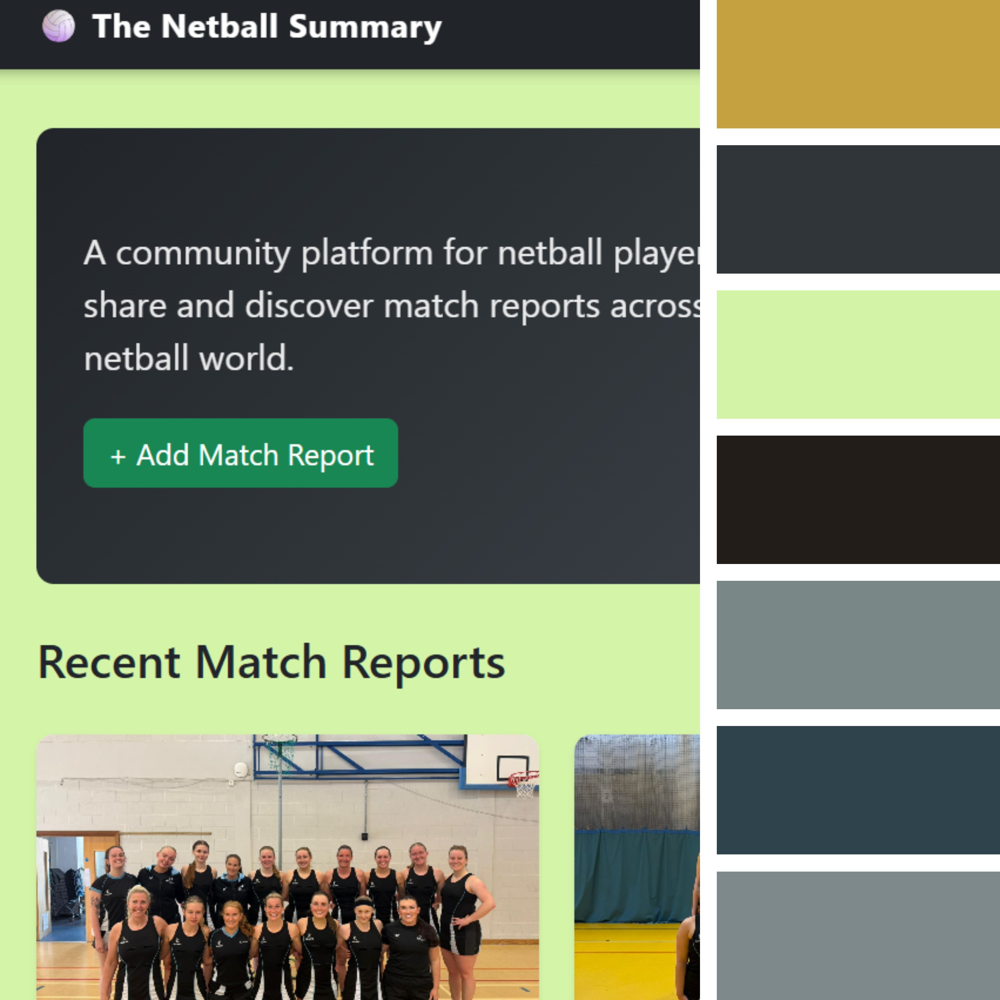

# The Netball Summary

A centralised platform for netball players, coaches and fans to create and share match reports. Instead of results being scattered across individual team pages and social media, The Netball Summary brings them together in one place - searchable, filterable and community-driven.

**Live site:** [https://the-netball-summary-168dbfef7a3e.herokuapp.com](https://the-netball-summary-168dbfef7a3e.herokuapp.com)

**GitHub repository:** [https://github.com/YemsAla/the_netball_summary](https://github.com/YemsAla/the_netball_summary)

## Table of Contents

- [Project Goals] (#project-goals)
- [User Stories] (#user-stories)
- [Design] (#design)
    - [Wireframes](#wireframes)
    - [Database Schema] (#database-schema)
    - [Colour Scheme and Typography](#colour-scheme-and-typography)
    - [Features](#features)
  - [Existing Features](#existing-features)
  - [Future Features](#future-features)
- [Technologies Used](#technologies-used)
- [Testing](#testing)
  - [Manual Testing](#manual-testing)
  - [Bugs and Fixes](#bugs-and-fixes)
  - [Responsiveness](#responsiveness)
  - [Browser Compatibility](#browser-compatibility)
- [Deployment](#deployment)
- [Credits](#credits)

---

## Project Goals

### External user goals

- Record the details of a netball match they have played or witnessed, including a score, image and written summary. They can also record the MVPs as voted by their team and the opposition.
- Browse and search match reports shared by other players to learn, compare performances and gain insights across all match types (leagues/friendlies/tournaments).

### Site owner goals

- Provide a reliable, community-driven platform that's easy-to-use, where netball players can document and share their match experiences.
- Build an engaged community where users regularly contribute their match reports and interact with each other's content by leaving comments.

---

## User Stories

    ✅ - successfully implemented
    ❌ - yet to be implemented

✅ 1. As a visitor, I want to browse all match reports without an account so that I can explore the platform before registering.

✅ 2. As a player, I want to register for an account so that I can create and manage my own match reports.

✅ 3. As a logged-in user, I want to create a match report so that I can document a match my team played.

✅ 4. As a logged-in user, I want to edit my own match report so that I can correct or update details after posting.

✅ 5. As a logged-in user, I want to delete my own match report so that I can remove reports I no longer want published.

✅ 6. As a logged-in user, I want to comment on any match report so that I can engage with reports from other teams.

✅ 7. As a visitor, I want to search reports by team name so that I can quickly find reports relevant to a team I follow.

✅ 8. As a visitor, I want to filter reports by match type so that I can distinguish between different match types.

✅ 9. As a site owner, I want editing restricted to report authors so that content integrity is maintained.

✅ 10. As a site owner, I want pagination on the reports list so that the page doesn't become exhaustive as the number of reports grows.

❌ 11. As a user, I want to like match reports so that I can show appreciation for content without having to comment

❌ 12. As a user, I want a forgotten password option so that I can recover my account if I forget my credentials.

---

## Design

### Wireframes

Wireframes were created using Balsamiq, for all key pages in desktop and mobile to plan layout and user flow.

#### Homepage

| Desktop | Mobile |
|---------|--------|
|  |  |

#### Match Reports List

| Desktop | Mobile |
|---------|--------|
|  |  |

#### Match Report Detail

| Desktop | Mobile |
|---------|--------|
|  |  |

#### Create / Edit Report Form

| Desktop | Mobile |
|---------|--------|
|  |  |

#### Login / Register

| Desktop | Mobile |
|---------|--------|
|  |  |

---

### Database Schema (ERD)

The database was designed to support match report creation and community interation.

**Relationships:**

- One `User` can create many `MatchReport` records (one-to-many)
- One `MatchReport` can have many `Comment` records (one-to-many)
- One `User` can write many `Comment` records (one-to-many)

**Design Decisions:**

Rather than creating separate `Team` & `League` tables, these were implemented as simple text fields within `Match Report` to reduce complexity for this MVP phase. The structure is designed so that it can be extended in future iterations.

---

### Colour Scheme and Typography

The site uses Bootstrap utilities for layout and spacing, with a custom stylesheet for the cards, score badges and hero section. The colour palette is kept minimal to remain readable and accessible across all devices.

**Typography:** Bootstrap's default sans-serif stack is used throughout. No custom fonts were imported, keeping page load times fast.

---

## Features

### Existing Features

**Navigation bar**

Present on all pages. Collapses to a hamburger menu on mobile and tablet. Shows Login and Register links when logged out and user's username with a Logout link when logged in.

**Hero section**

A full-width hero section on the homepage with a description of the site's purpose and CTA button. The hero image is hidden on mobile using `d-none d-md-block` to keep the layout clean on smaller screens.

**Match reports list**

Displays all submitted match reports as cards showing the match title, team names, score, report excerpt, league and date. Includes a CTA to read the full report on the match report detail page. Pagination is set at 5 reports per page for better usability and reports can be filtered by team name or match type using the search bar and dropdown.

**Report detail page**

Shows the full match report details including a team picture, score display, complete match summary, player of the match for both teams, date and match type. Edit and Delete buttons are only visible to the report's author.

**Create match report**

This displays a form to logged-in users only capturing: title, team name, opponent name, scores, image, match type, match date, match summary and both players of the match. Once a report is successfully subitted,  the user is redirected to the new report's detail page with a success message.

**Edit match report**

Identical to the create form, pre-populated with existing data but both the page & button titles change to 'Update' rathar than 'create'. This feature is only accessible to the report's author; any attempt to access another user's edit URL returns an error. Uses `get_absolute_url()` to redirect correctly on both create and update.

**Delete match report**

A confirmation page displaying the report title before deletion. Deleting redirects to the reports list page with a success message. A Cancel button returns the user to the match report detail page.

**User registration and login**

Using standard Django authentication. Login and logout both redirect to the homepage. Registration validates that passwords match before creating the account.

**Comments**

Logged-in users can add comments to any match report. Comments display with most recently added first. Logged-out users see a "Log in to comment" link that returns them directly to the comment section after authentication using the `?next=` parameter with a `#comment` anchor.

**Flash messages**

Success and error messages display at the top of the page after key actions including create, edit, delete and comment.

**Pagination**

The reports list is paginated at 5 reports per page with numbered navigation at the bottom of the page.

---

### Future Features

- Ability to 'Like' to allow users to react to match reports without having to comment
- Comment deletion so users can remove their own comments
- Forgot password flow with email-based reset
- Separate Team and League models for richer filtering and league tables
- Improved paragraph rendering in match report body text on the report detail page (currently all text displays together)
- Username styling differentiation in comments for better readability (make it bolder)
- Firefox browser testing

---

## Technologies Used

### Languages

- Python 3
- HTML5
- CSS3

### Frameworks and Libraries

| Package | Purpose |
|---------|---------|
| Django 6.0.3 | Main web framework |
| Bootstrap 5 | Front-end layout and components |
| Gunicorn | WSGI HTTP server for Heroku deployment |
| Whitenoise | Serves static files in production |
| Cloudinary + dj3-cloudinary-storage | Media file storage |
| dj-database-url | Database URL parsing for Heroku |
| psycopg2-binary | PostgreSQL adapter |
| python-dotenv | Environment variable management |
| Pillow | Image handling |

### Tools and Services

- **Git / GitHub** — version control
- **Heroku** — deployment platform
- **PostgreSQL** — production database
- **SQLite** — local development database
- **VS Code** — code editor
- **Balsamiq** — wireframe creation

---

## Testing

Full testing documentation including manual tests, bug fixes and browser compatibility can be found in [TESTING.md](TESTING.md)

---

## Deployment

The project is deployed on **Heroku** using a PostgreSQL database.

### Local development setup

1. Clone the repository: 
git clone https://github.com/YemsAla/the_netball_summary.git
cd the_netball_summary

2. Create and activate a virtual environment:
python -m venv venv
source venv/bin/activate

3. Install dependencies:
pip install -r requirements.txt

4. Create a `.env` file in the root directory with the following variables:
SECRET_KEY=your-secret-key
DATABASE_URL=your-database-url
CLOUDINARY_URL=your-cloudinary-url
DEBUG=True

5. Run migrations and start the development server:
python manage.py migrate
python manage.py runserver

### Heroku deployment

1. Create a new Heroku app.
2. In the Heroku dashboard go to **Settings → Config Vars** and add:
   - `SECRET_KEY`
   - `DATABASE_URL`
   - `CLOUDINARY_URL`
3. Connect the GitHub repository under the **Deploy** tab.
4. Ensure `Procfile` contains:
web: gunicorn the_netball_summary.wsgi

5. Run migrations on Heroku:
heroku run python manage.py migrate

6. Deploy via the Heroku dashboard or push to the connected branch.

### Forking the repository

1. Log in to GitHub and locate the repository.
2. At the top of the repository page click the **Fork** button.
3. You will now have a copy of the repository in your GitHub account.

### Making a local clone

1. Log in to GitHub and locate the repository.
2. Click **Code** and copy the HTTPS URL.
3. Open your terminal and run:
git clone https://github.com/YemsAla/the_netball_summary.git

---

## Credits

### Content

All match report content used during development and testing was created for demonstration purposes.

### Media

- Hero image: [pikisuperstar on Freepik](https://www.freepik.com/free-vector/basketball-team-illustration_2686637.htm)
- Netball team images (personally owned)

### Code and Resources

- [Django documentation](https://docs.djangoproject.com/) — core framework reference
- [Bootstrap 5 documentation](https://getbootstrap.com/docs/5.0/) — grid system and components
- [Django authentication system](https://docs.djangoproject.com/en/stable/topics/auth/) — login, logout and registration
- [Code Institute](https://codeinstitute.net/) — project structure and deployment guidance
- [Claude by Anthropic](https://claude.ai) — used as a development aid for debugging, code guidance and README documentation

### Acknowledgements

- My tutor/mentor Rachel for guidance and direction throughout the project.
- The Code Institute community 