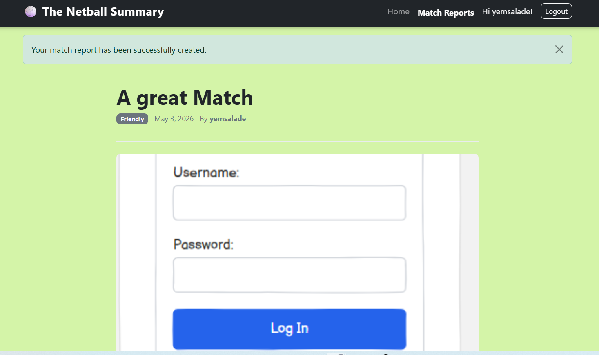
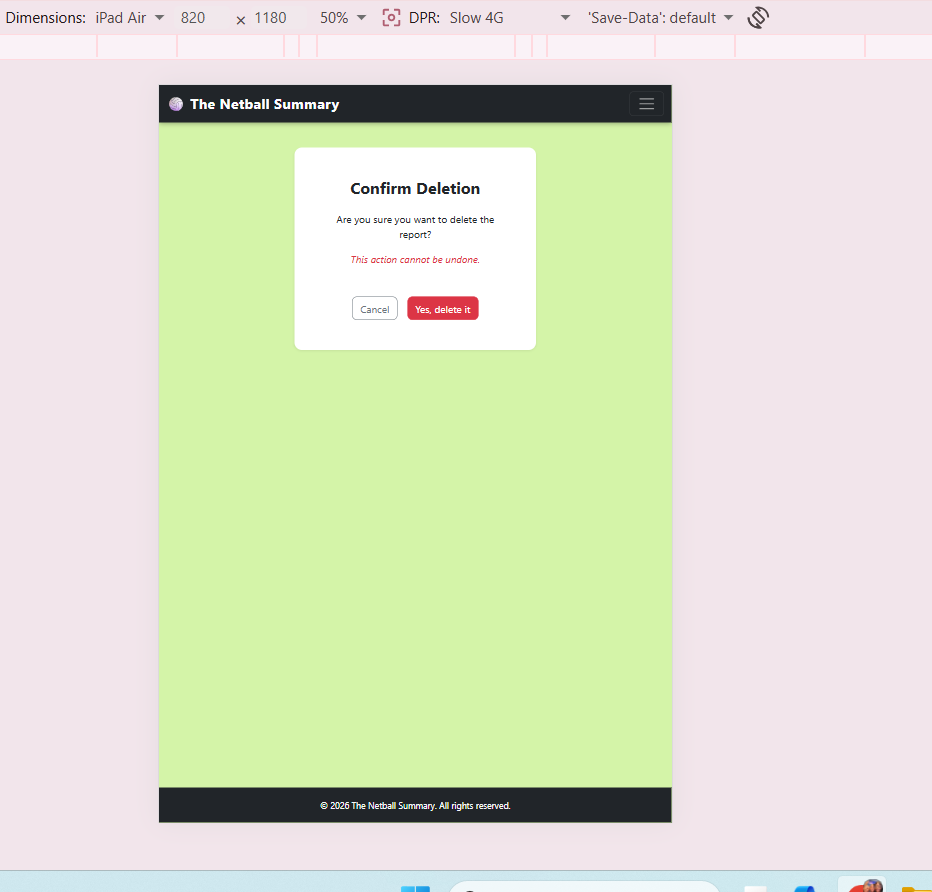
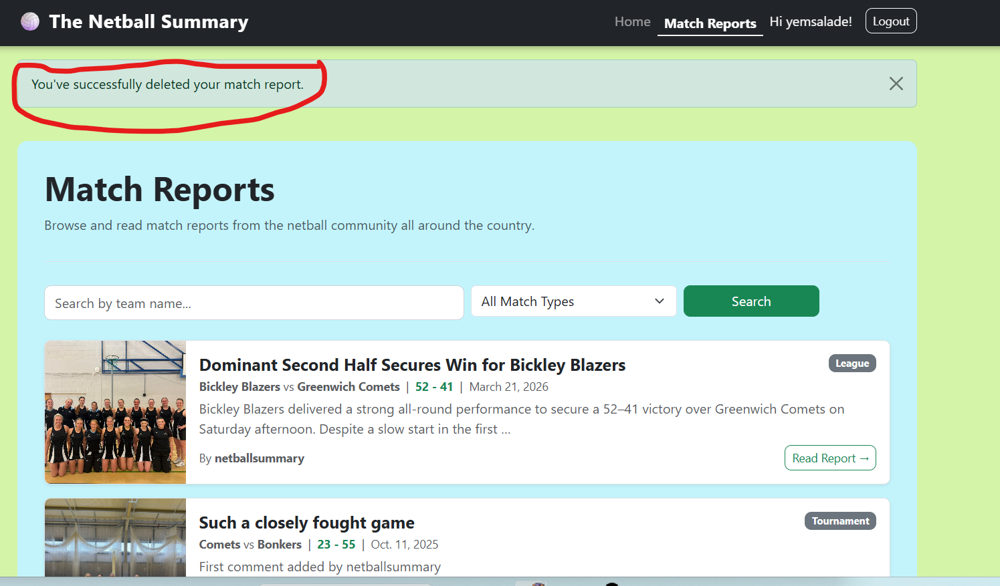
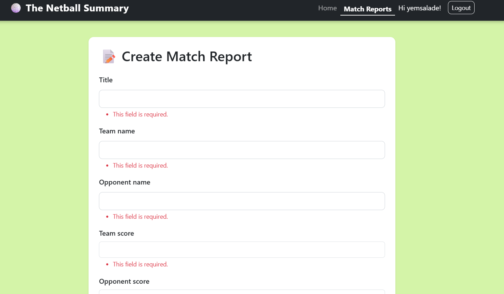
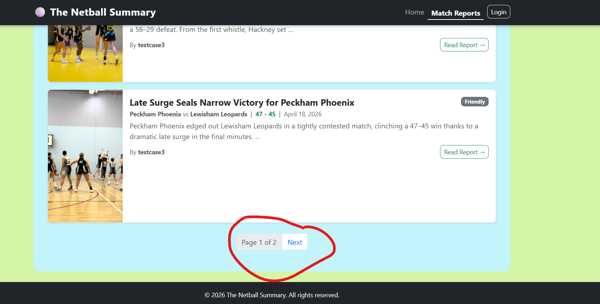

# The Netball Summary — Testing

[Return to README](README.md)

## Table of Contents

- [Manual Testing](#manual-testing)
  - [Authentication](#authentication)
  - [CRUD](#crud)
  - [Comments and Search](#comments-and-search)
- [Bugs and Fixes](#bugs-and-fixes)
- [Known Issues](#known-issues)
- [Responsiveness](#responsiveness)
- [Browser Compatibility](#browser-compatibility)

---

## Manual Testing

### Authentication

| Test | Expected result | Actual result | Pass/Fail |
|------|----------------|---------------|-----------|
| Register with valid credentials | Redirected to homepage with welcome message | As expected | ✅ Pass |
| Login with valid credentials | Redirected to homepage, logged in | As expected | ✅ Pass |
| Login with wrong password | Error message shown, stays on login page | As expected | ✅ Pass |
| Logout | Redirected to homepage, nav shows Login | As expected | ✅ Pass |
| Register with mismatched passwords | Error messages shown next to relevant fields | As expected | ✅ Pass |

---

### CRUD

| Test | Expected result | Actual result | Pass/Fail |
|------|----------------|---------------|-----------|
| Create a match report | Redirected to report detail with success message | As expected | ✅ Pass |
| Read a match report | Full detail page loads with all fields visible | As expected | ✅ Pass |

| Update a match report | Redirected to detail page with success message | As expected | ✅ Pass |
| Delete a match report | Redirected to reports list with success message | As expected | ✅ Pass |

| Authorisation check — edit another user's report URL directly | 403 Forbidden | As expected | ✅ Pass |
| Submit empty create form | Validation errors shown, no report created | As expected | ✅ Pass |

| Unauthenticated user visits /reports/create/ | Redirected to login page | As expected | ✅ Pass |
| Pagination — more than 5 reports exist | Pagination panel appears, Next loads next page | As expected | ✅ Pass |

---

### Comments and Search

| Test | Expected result | Actual result | Pass/Fail |
|------|----------------|---------------|-----------|
| Comment on a report when logged in | Comment appears with success message | As expected | ✅ Pass |
| Attempt to comment when logged out | Form not visible, login link shown | As expected | ✅ Pass |
| Search by team name | Only matching reports shown | As expected | ✅ Pass |
| Filter by match type | Only reports of that type shown | As expected | ✅ Pass |
| Search with no results | "No match reports yet" message shown | As expected | ✅ Pass |

---

## Bugs and Fixes

| Bug | Fix |
|-----|-----|
| Login redirected to reports list instead of homepage | Updated `LOGIN_REDIRECT_URL` in `settings.py` to `'home'` |
| Logout redirected to reports list instead of homepage | Updated `LOGOUT_REDIRECT_URL` in `settings.py` to `'home'` |
| "Log in to comment" redirected to homepage instead of the comment section | Added `id="comment"` anchor to the comment card and appended `?next={{ request.path }}%23comment` to the login URL |
| Submitting empty create form showed no validation errors | Added `novalidate` to the form tag in `report_form.html` to allow Django server-side validation to run, then added `required` attributes to all mandatory fields in `forms.py` |

---

## Known Issues

| Issue | Notes |
|-------|-------|
| Match report body text displays as a single block despite paragraph breaks being entered | A future fix would apply Django's `linebreaks` template filter to preserve formatting |
| "Recent Match Reports" heading wraps to two lines at 375px | Expected behaviour at that viewport width, not considered a critical issue |
| Error state on login UI could be improved | Logged as a future UI improvement |

---

## Responsiveness

Tested across mobile (375px), tablet (820px) and desktop (1280px+). Bootstrap's grid system handles the majority of responsive behaviour.

| Breakpoint | Result |
|-----------|--------|
| Mobile (375px) | Hero image hidden using `d-none d-md-block`. Navbar collapses to hamburger. Cards readable. No overflow. |
| Tablet (820px) | Navbar collapses to hamburger. Score display stacks correctly. Cards readable. No overflow. |
| Desktop (1280px+) | Site displays at full width. All sections render correctly. |

**Comment form improvement:** The default Django `form.as_p` rendering created a misaligned `Content:` label on the comment form across all screen sizes. This was resolved by replacing the default rendering with a custom textarea using a placeholder, removing the label entirely.

---

## Browser Compatibility

| Browser | Result | Notes |
|---------|--------|-------|
| Chrome | ✅ Pass | All pages render and function correctly |
| Edge | ✅ Pass | All pages render and function correctly |
| Firefox | Not tested | Deferred to a future iteration |

---

[Return to README](README.md)